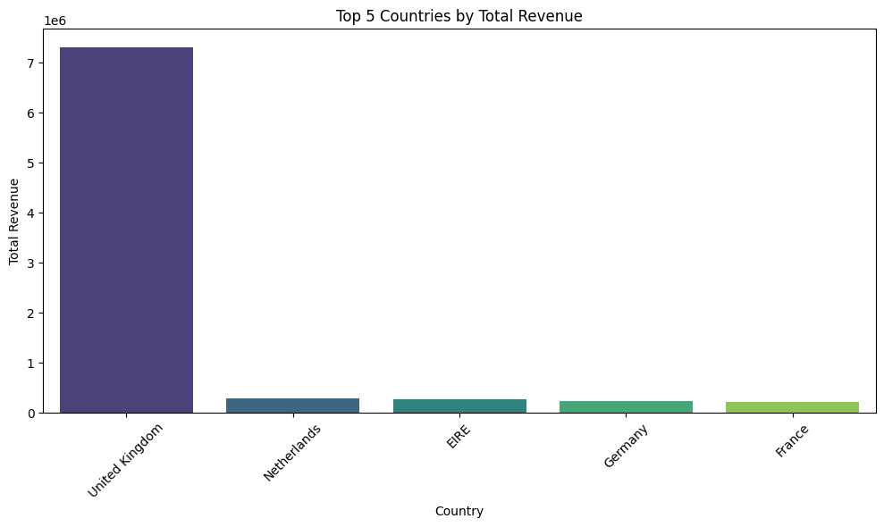

# Sales_Data_Analysis
Analysis of sales data to identify top-performing countries using Python and Seaborn
# Sales Data Analysis Project
## Overview
This project analyzes sales data from an online retail store to identify the top 5 countries by total revenue. The analysis uses Python, Pandas for data manipulation, and Seaborn for visualization.

## Tools Used
- Python
- Pandas, NumPy, Matplotlib, Seaborn
- Google Colab

## Dataset
- Source: [(https://www.kaggle.com/datasets/ulrikthygepedersen/online-retail-dataset/data))
- Columns: InvoiceNo, StockCode, Description, Quantity, InvoiceDate, UnitPrice, CustomerID, Country

## Methodology
1. Loaded and cleaned the dataset (removed missing values and negative quantities).
2. Calculated total revenue per transaction (Quantity * UnitPrice).
3. Grouped data by country and summed total revenue.
4. Visualized the top 5 countries using a bar chart.

## Results
- The top 5 countries by total revenue are displayed in the bar chart (e.g., EIRE, Germany, France, etc.).
- Insights can be used to focus marketing or logistics efforts on high-revenue regions.

## How to Run
1. Upload the dataset to Google Colab.
2. Run the cells in the `Sales_Analysis.ipynb` notebook in order.
3. View the bar chart and printed results.

## Visualization

## Author
[Abena Konadu Adofo | [www.linkedin.com/in/abena-konadu-adofo-20406019a]
